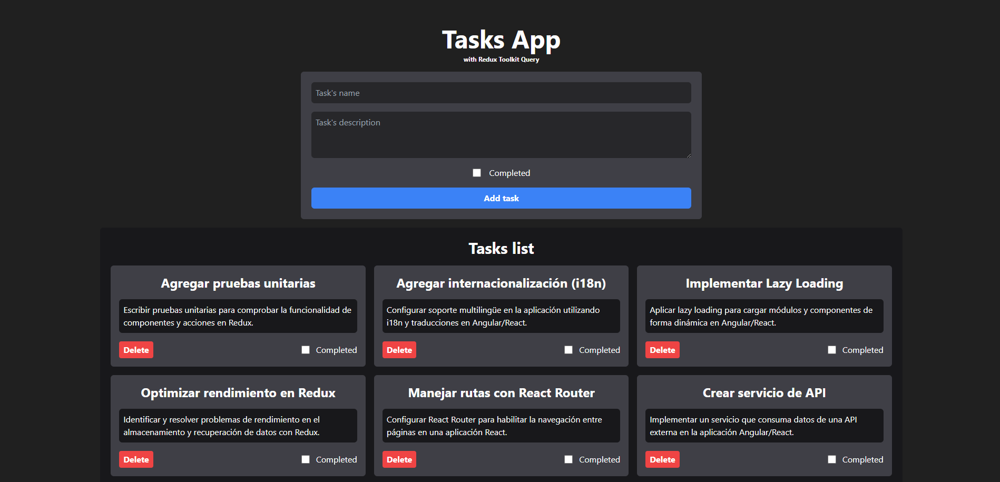

# Proyecto Vite + React + TailwindCSS

Este proyecto utiliza Vite, React y TailwindCSS para crear una aplicación de tareas.

## Screenshots


## Instalación

Este proyecto utiliza pnpm en lugar de npm. Para instalar las dependencias, ejecuta:

```bash
  pnpm install
```

## Uso

Para iniciar el servidor de desarrollo, ejecuta:

```bash
  pnpm run dev
```

La aplicación se ejecutará en `http://localhost:5173`.

## Características

- Agregar, eliminar y actualizar tareas
- Marcar tareas como completadas
- Interfaz de usuario con TailwindCSS
- Manejo del estado con Redux Toolkit Query

## Descripción detallada del código

El código se dividió en varios componentes:

- `App`: Este es el componente principal de la aplicación. Renderiza los componentes `TaskForm` y `TasksList`.
- `TaskForm`: Este componente muestra un formulario para agregar una nueva tarea. Utiliza el hook `useCreateTaskMutation` de Redux Toolkit Query para manejar la creación de una nueva tarea.
- `TasksList`: Este componente muestra una lista de tareas. Utiliza los hooks `useGetTasksQuery`, `useDeleteTaskMutation` y `useUpdateTaskMutation` de Redux Toolkit Query para manejar la obtención, eliminación y actualización de tareas. Las tareas se pasan al componente `TaskCard` junto con las funciones `deleteTask` y `updateTask`.
- `TaskCard`: Este componente recibe las tareas, la función `deleteTask` y la función `updateTask` como props. Muestra el nombre, la descripción y el estado de finalización de cada tarea. También hay un botón de eliminar para cada tarea que llama a la función `deleteTask` cuando se hace clic, pasando el id de la tarea. El estado de finalización de cada tarea se puede actualizar marcando o desmarcando la casilla de verificación, lo que llama a la función `updateTask` con el objeto de tarea actualizado.

También se creó un archivo `apiSlice.js`, que utiliza Redux Toolkit Query para manejar las operaciones de la API. Define cuatro puntos finales: `getTasks`, `createTask`, `deleteTask` y `updateTask`, que realizan solicitudes GET, POST, DELETE y PATCH a la API, respectivamente.


## Authors

- [@lace04](https://www.github.com/lace04)